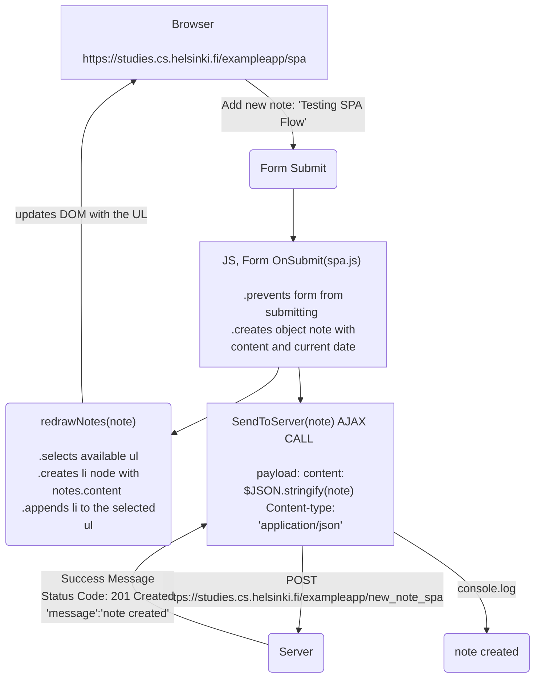

```mermaid
    flowchart
     A[Browser \n https://studies.cs.helsinki.fi/exampleapp/spa] --> |Add new note: 'Testing SPA Flow'| B(Form Submit) --> C["JS, Form OnSubmit(spa.js) \n\n .prevents form from submitting \n .creates object note with content and current date"] --> D("redrawNotes(note)"\n\n .selects available ul \n .creates li node with notes.content \n .appends li to the selected ul)
     D --> |updates DOM with the UL| A
     C --> E["SendToServer(note) AJAX CALL \n\n payload: content: $JSON.stringify(note) \n Content-type: 'application/json' "]
     E --> |POST https://studies.cs.helsinki.fi/exampleapp/new_note_spa| F(Server)
     F --> |Success Message \n Status Code: 201 Created \n 'message':'note created'| E
     E --> |console.log| G(note created)
```