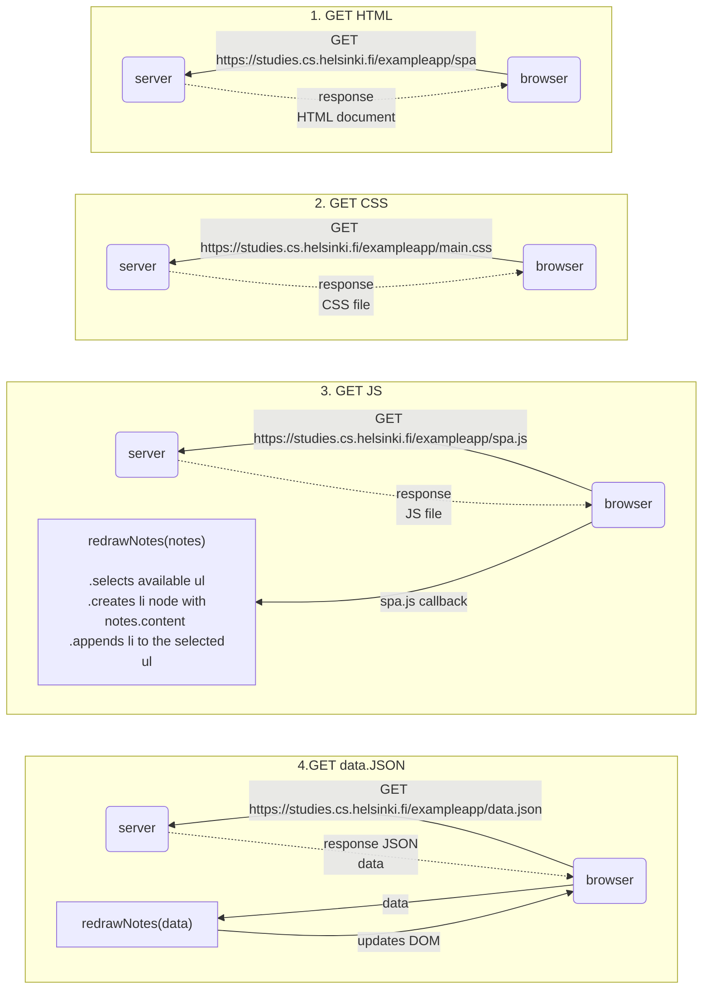

```mermaid
    flowchart LR
        subgraph 4.GET data.JSON
        direction RL
            H(browser) --> |GET https://studies.cs.helsinki.fi/exampleapp/data.json| I(server)
            I -.-> |response JSON \n data| H
            H --> |data|J["redrawNotes(data)"]
            J --> |updates DOM|H
        end

        subgraph 3. GET JS
        direction RL
            E(browser) --> |GET https://studies.cs.helsinki.fi/exampleapp/spa.js| F(server)
            F(server) -.-> |response \n JS file| E
            E --> |spa.js callback| G["redrawNotes(notes)\n\n .selects available ul \n .creates li node with notes.content \n .appends li to the selected ul"]
        end

        subgraph 2. GET CSS
        direction RL
            C(browser) --> |GET https://studies.cs.helsinki.fi/exampleapp/main.css| D(server)
            D -.-> |response \n CSS file| C
        end

        subgraph 1. GET HTML
        direction RL
            A(browser) --> |GET https://studies.cs.helsinki.fi/exampleapp/spa| B(server)
            B -.-> |response \n HTML document| A
        end
```